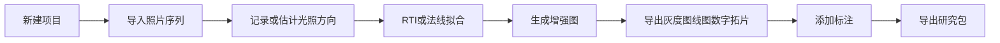

# 07 后续软件工作流规划

## 目标

在RTI理论学习、工具链复现和微痕专题实验之后，逐步开发一套面向汉画像石、碑刻和浅刻文物的采集、处理、增强、标注和发布工作流。软件开发应从最小闭环开始，不一开始追求完整商业系统。

更完整的软件栈与数据架构见 `13-software-stack-and-architecture.md`。数据集规范见 `datasets/README.md`，实验记录模板见 `experiments/README.md`。

## 最小闭环

第一版软件只需要完成以下闭环：



## 功能模块

### 项目管理

功能：
- 新建对象项目。
- 管理采集批次。
- 管理处理版本。
- 记录文物基本档案。

字段：
- 文物编号。
- 名称。
- 类型。
- 材质。
- 尺寸。
- 地点。
- 采集日期。
- 采集人。
- 权限和版权说明。

### 数据导入

功能：
- 导入照片序列。
- 支持RAW/JPEG/TIFF。
- 导入或生成capture.json。
- 导入或生成lights.csv。

质量检查：
- 图像数量。
- 分辨率一致性。
- EXIF一致性。
- 模糊检测。
- 曝光异常检测。
- 位移检测。

### 预处理

功能：
- 去畸变。
- 裁剪。
- 对齐。
- 曝光一致化。
- 白平衡统一。
- 背景遮罩。
- 反光球检测。

注意：
- 每一步必须保存参数。
- 原始图像不覆盖。
- 预处理输出作为新版本保存。

### 光照估计

方式：
- 反光球高光估计。
- 固定光源矩阵几何标定。
- 手动录入光照方向。
- 从Relight/RTIBuilder导入光照文件。

输出：
- lights.csv。
- 光照方向可视化图。
- 光照覆盖质量报告。

### RTI和表面拟合

方法：
- PTM。
- HSH。
- RBF。
- 光度立体法线估计。
- 高度图实验。

输出：
- RTI/PTM/HSH/RBF文件。
- 法线图。
- 反照率图。
- 拟合误差图。

### 微痕增强输出

输出类型：
- 增强图。
- 灰度图。
- 数字线图。
- 数字拓片。
- 法线图。
- 交互式RTI。

增强方法：
- 虚拟掠射光。
- diffuse gain。
- specular enhancement。
- 局部对比度增强。
- 边缘增强。
- 背景纹理压制。

### 标注与释读

标注类型：
- 文字框。
- 图像纹样。
- 刻痕线。
- 裂隙。
- 残损。
- 污染。
- 病害。
- 释读文本。
- 置信度。

要求：
- 标注必须绑定到具体输出版本。
- 标注应能回溯到原始图像和处理参数。
- 支持多个研究者给出不同释读。

### 导出与发布

导出包：
- 原始照片索引。
- 采集元数据。
- 处理参数。
- RTI文件。
- 增强图。
- 数字拓片。
- 线图。
- 标注文件。
- README。

Web发布：
- OpenLIME查看器。
- 高分辨率瓦片。
- IIIF兼容方向。
- 注释层。
- 对比视图。

## 简化全信息模型草案

第一版可使用JSON描述对象包：

```json
{
  "object": {
    "id": "object_001",
    "name": "",
    "type": "stone_relief",
    "material": "stone",
    "dimensions": {}
  },
  "capture_sessions": [],
  "image_sets": [],
  "light_sets": [],
  "processing_runs": [],
  "outputs": [],
  "annotations": [],
  "interpretations": []
}
```

后续可扩展为SQLite：
- objects。
- capture_sessions。
- images。
- lights。
- processing_runs。
- outputs。
- annotations。
- interpretations。
- files。

## 与RTI学习阶段的关系

软件开发必须等待以下学习成果成熟：
- 已理解PTM/HSH/RBF和光度立体的基础。
- 已跑通至少1个公开RTI数据集。
- 已完成至少1个自采刻痕样本。
- 已定义增强图、灰度图、线图、数字拓片的输出标准。
- 已形成采集SOP草案。

## 开发优先级

第一优先级：
- 项目结构和数据导入。
- 元数据记录。
- 调用外部工具处理RTI。
- 增强图/灰度图/数字拓片导出。

第二优先级：
- 自研基础光照估计。
- 自研法线增强和数字拓片。
- 标注工具。
- 研究包导出。

第三优先级：
- OpenLIME Web发布。
- 多人协作标注。
- AI辅助分割和识读。
- 汉画像石纹样检索。

补充工具优先级：
- 处理后端优先评估RelightLab/Relight CLI。
- 3D整体建模优先评估COLMAP或Meshroom。
- 标注工具优先评估AnyLabeling和CVAT。
- Web发布优先评估OpenLIME、IIIF和Annotorious。
- 大数据版本管理优先评估DVC或NAS索引方案。

## 本阶段交付物

- 软件最小闭环需求说明。
- 数据模型草案。
- 工具链集成建议。
- 输出格式定义。
- 后续开发路线图。

## 待办

- [ ] 根据Relight实验结果确定第一版处理后端。
- [ ] 定义项目目录结构。
- [ ] 定义JSON对象包格式。
- [ ] 定义数字拓片和线图输出标准。
- [ ] 设计第一版桌面或Web界面流程。
