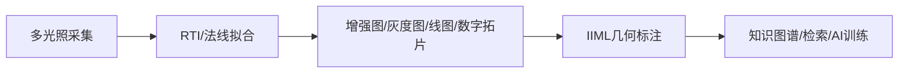

# 10 IIML与形相学知识库草案

## 定位

本文用于把“形相学”、IIML图像学信息建模语言、汉画像石全信息模型和后续AI标注系统整理成可复用的开发参考。它不是已验证标准的正式说明书，而是面向后续软件原型、知识图谱、AI语料和数据结构设计的工作草案。

使用边界：
- 已有公开资料中明确出现的概念，作为优先参考。
- 学术归因、论文细节和具体频率数值需要在进入正式论文或产品文档前二次核验。
- 工程实现先采用可验证的开放格式，如JSON-LD、IIIF、Web Annotation和JSON Schema。
- 不把IIML等同于IIIF；IIIF偏图像资源互操作，IIML偏图像元素、坐标、语义和脚本关系的组织。

## 核心概念

### 形相学

形相学可以理解为面向图像形式本身的研究框架。它关注的不只是图像“讲了什么故事”，还包括图像的形式、痕迹、结构、纹样、节律、材质和制作技术。

对汉画像石和浅刻文物来说，这一框架的价值在于：
- 图像元素经常不是彩色绘画，而是线刻、浅浮雕、拓片、灰度增强图和数字线图。
- 很多信息存在于细微刻痕、轮廓关系、重复纹样和空间布局中，不能只靠自由文本标签表达。
- AI训练需要稳定的坐标、层级、术语、版本和置信度，而不是散乱注释。

### IIML

IIML可作为“图像资源 + 几何坐标 + 语义脚本”的组织协议来理解。第一版软件不必一次实现完整IIML，但应保留这些核心能力：
- 一个文物对象可以绑定多个资源版本，如原始照片、RTI增强图、灰度图、数字拓片、线图、法线图和IIIF瓦片。
- 一个标注必须绑定到具体资源和处理版本，避免跨版本坐标漂移。
- 一个标注可以有父子层级，例如整体画面、局部情节、单一形象、构成形状、点线痕迹。
- 一个标注可以同时保存客观图义、文化阐释、铭文、材质、工艺、置信度和研究者信息。

## 三元数据架构

### Resource 资源层

资源层记录可被查看、处理或引用的数据实体。

常见类型：
- IIIF图像资源。
- 原始图像序列。
- RTI、PTM、HSH或RBF文件。
- 法线图、深度图、高度图、灰度图、数字拓片和线图。
- 3D模型、点云、多光谱图层。
- 研究文献、释读说明、采集记录和处理参数。

关键字段：
- `id`：稳定资源ID。
- `type`：资源类型。
- `uri`：文件路径、IIIF地址或对象存储地址。
- `format`：MIME类型或专用格式。
- `derivedFrom`：上游资源ID。
- `processingRunId`：处理过程ID。
- `coordinateSystem`：像素坐标、物理坐标、3D坐标或时间坐标。

### Annotation 几何标注层

标注层负责把图像局部区域精确锚定到资源上。

几何类型：
- `Point`：弱语义锚点，适合用户点击、中心点、关键点。
- `LineString`：开放线条，适合刻痕、轮廓线、裂隙。
- `Polygon`：闭合区域，适合图像元素、病害、纹样块。
- `MultiPolygon`：多个离散区域组成的同一语义对象。
- `BBox`：粗框选，适合快速标注和检索。

坐标要求：
- 默认使用图像像素坐标，原点为左上角。
- 必须记录坐标绑定的资源版本。
- 多边形建议显式闭合，即首尾点一致。
- 坐标变换需要记录矩阵或处理链，不能只覆盖原坐标。

### Script 语义脚本层

脚本层记录标注之间、资源之间、术语之间的关系。

关系类型：
- 层级关系：`contains`、`partOf`。
- 空间关系：`above`、`below`、`leftOf`、`rightOf`、`overlaps`、`intersects`。
- 叙事关系：`actsOn`、`faces`、`holds`、`rides`、`attacks`。
- 推理关系：`sameAs`、`closeMatch`、`broader`、`narrower`、`seeAlso`。
- 版本关系：`derivedFrom`、`supersedes`、`alternativeInterpretationOf`。

脚本层应尽量使用受控谓词，不把复杂关系全部写成自然语言。

## 图像元素本体

第一版知识图谱可以从以下实体开始。

### CulturalObject 文物对象

用于记录汉画像石、碑刻、墓葬构件、拓片或采集对象。

建议字段：
- `objectId`
- `name`
- `objectType`
- `period`
- `location`
- `material`
- `dimensions`
- `currentRepository`
- `rights`

### Resource 资源

用于记录图像、RTI、多光照数据、派生图和文献。

建议字段见资源层。

### Annotation 标注

用于记录坐标、层级、语义和研究者判断。

建议字段：
- `id`
- `resourceId`
- `target`
- `structuralLevel`
- `label`
- `semantics`
- `confidence`
- `createdBy`
- `createdAt`
- `updatedAt`

结构层级建议：
- `whole`：整体对象或整幅画面。
- `scene`：局部场景或叙事情节。
- `figure`：人物、动物、器物、神怪等单一形象。
- `component`：面部、手臂、器物局部、纹样单元。
- `trace`：刻痕、线段、点、边缘和微痕。

### OntologyTerm 术语

用于替代自由标签。

建议字段：
- `id`
- `prefLabel`
- `altLabel`
- `scheme`
- `broader`
- `narrower`
- `closeMatch`
- `exactMatch`
- `definition`

本地词表可以先建立中国图像志索引典草案，再逐步映射到ICONCLASS、Wikidata、Getty AAT等外部知识源。

### Relation 关系

用于表达标注、术语、对象之间的显式关系。

建议字段：
- `subject`
- `predicate`
- `object`
- `confidence`
- `source`
- `note`

示例：
- 伏羲 `intersectsWith` 女娲。
- 舞者 `partOf` 乐舞图。
- 松树 `exactMatch` 某个外部词表URI。

## JSON-LD实现建议

JSON-LD适合作为第一版交换格式，因为它既能作为普通JSON被前后端使用，也能逐步映射到知识图谱。

设计原则：
- `@context`固定版本化，避免字段语义漂移。
- 所有核心实体使用稳定ID，推荐URI或URN。
- 坐标只描述几何，不混入释读文本。
- 语义解释、图像学术语和图像志推理分层保存。
- 研究者不同意见使用多个annotation或interpretation，不覆盖旧结论。

最小文档结构：

```json
{
  "@context": "https://example.org/iiml/context/v0.1.jsonld",
  "@type": "IIMLDocument",
  "documentId": "han-stone-demo-001",
  "name": "汉画像石示例对象",
  "resources": [],
  "annotations": [],
  "relations": [],
  "vocabularies": [],
  "provenance": {}
}
```

本仓库配套的机器校验草案见 `iiml-jsonld.schema.json`。

## 与RTI工作流的关系

IIML层不替代RTI采集和微痕增强，而是承接它们的结果。

推荐数据流：



关键约束：
- 标注必须指向某一个输出资源，例如增强图或线图。
- 如果同一对象有多个输出版本，标注应记录坐标所属版本。
- 从RTI增强图迁移到原图或IIIF瓦片时，需要保存坐标变换。
- AI生成的分割、多边形和释读必须带置信度和生成模型信息。

## AI辅助多边形标注

SAM或其他分割模型可以用于从用户点击点、粗框或文本提示中生成候选多边形。进入IIML前需要做后处理：
- 提取最大或目标轮廓。
- 使用Douglas-Peucker等算法简化顶点。
- 保证多边形闭合。
- 记录原始mask、模型名称、权重版本、提示点和置信度。
- 支持人工校正，人工确认后再作为正式标注。

候选数据结构：

```json
{
  "id": "urn:uuid:annotation-001",
  "resourceId": "urn:uuid:resource-enhanced-001",
  "target": {
    "type": "Polygon",
    "coordinates": [[[817, 652], [1392, 652], [1392, 1638], [817, 1638], [817, 652]]]
  },
  "generation": {
    "method": "sam",
    "model": "sam-vit-h",
    "prompt": {
      "points": [[500, 600]],
      "labels": [1]
    },
    "confidence": 0.86,
    "reviewStatus": "candidate"
  }
}
```

## 形相学声频化原型

声频化可以作为研究型实验模块，用于把纹样的连续节律转成可听或可比较的物理量。它不应在早期被当成已验证的文物解释结论，而应作为探索性分析。

### 一维连续纹样

适用对象：
- 连弧纹。
- 波浪纹。
- 三角连续纹。
- 边框重复纹样。

处理步骤：
- 从增强图或线图中提取边缘。
- 估计周期、波长、振幅和相位。
- 拟合正弦或分段周期函数。
- 把空间周期映射到频率或MIDI节奏。
- 输出参数表、波形图和音频文件。

### 二维中心对称纹样

适用对象：
- 柿蒂纹。
- 四方连续纹样。
- 中心放射式装饰。

处理步骤：
- 提取骨架、对称轴和关键节点。
- 转换到极坐标或归一化方形坐标。
- 与模板库做相似度匹配，例如SSIM、Hu矩、关键点匹配。
- 若使用克拉尼图形比对，应明确这是类比分析，不直接证明古代物理声学来源。

### 节奏生成

视觉锚点可以映射到节奏：
- 半径映射到音高或音色。
- 角度映射到节拍位置。
- 面积、线宽或显著性映射到力度。
- 层级关系映射到多声部。

## 系统模块建议

第一版软件可以拆成以下模块：
- `resource-manager`：管理对象、采集批次、图像资源和派生版本。
- `annotation-editor`：Web端Canvas/WebGL标注器，支持点、线、多边形和层级树。
- `segmentation-service`：封装SAM、OpenCV和后处理。
- `ontology-service`：管理本地词表和外部词表映射。
- `iiml-exporter`：导出JSON-LD、简化XML、IIIF Annotation或研究包。
- `sonification-lab`：实验性声频化算法和音频导出。
- `knowledge-graph`：把对象、标注、术语和关系写入Neo4j、RDF或Wikibase。

第一阶段不必全部实现。更稳妥的最小闭环是：
- 导入一个增强图或线图。
- 手工创建多边形标注。
- 绑定一个受控术语。
- 导出JSON-LD。
- 用JSON Schema校验。

## 开发优先级

近期：
- 完成IIML JSON-LD最小数据结构。
- 建立汉画像石常用实体词表草案。
- 实现多边形标注和导出。
- 把RTI增强图、线图、数字拓片纳入资源版本链。

中期：
- 接入SAM候选分割。
- 建立标注审核状态。
- 支持IIIF Image API和Web Annotation互操作。
- 建立Neo4j或RDF知识图谱导入脚本。

远期：
- 训练汉画像石专用分割或检索模型。
- 建立跨馆藏、跨版本、跨词表的图像志索引。
- 进行纹样节律、声频化和视觉形式比较实验。

## 风险与待核验点

需要后续核验：
- IIML正式规范的字段、XML标签和版本号。
- 形相学相关公开论文、会议报告和术语定义。
- 《汉画总录》衍生系统中的真实数据结构。
- 视觉声频化研究的实验条件、频率映射依据和可重复性。
- ICONCLASS、中国本土词表和Wikidata之间的合法映射方式。

工程风险：
- 多边形标注很容易受图像版本影响，必须记录版本链。
- AI分割在浅刻、拓片和高噪声石材上可能出现伪轮廓。
- 自由文本释读难以支持检索和推理，应尽早引入受控词表。
- 知识图谱不应过早复杂化，先保证基础JSON-LD稳定。
