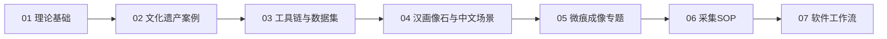

# RTI Learning

本目录用于沉淀RTI学习、实验复现、微痕成像专题和后续软件工作流设计。主线是先系统学习RTI理论和工具链，再把公开微痕成像资料中的工程路线作为RTI延伸专题来复现和吸收。

## 学习路线

## 阶段文档

- [01-theory.md](01-theory.md)：RTI、PTM、HSH、RBF、光度立体、法线图、增强渲染和数据格式。
- [02-cultural-heritage-cases.md](02-cultural-heritage-cases.md)：碑刻、墓碑、陶器印章、石质浅浮雕和大型文物案例。
- [03-toolchain-and-datasets.md](03-toolchain-and-datasets.md)：RelightLab、RTIViewer、RTIBuilder、OpenLIME和公开数据集复现。
- [04-han-stone-reliefs.md](04-han-stone-reliefs.md)：汉画像石、拓片恢复、中文石碑扫描和2.5D浅刻文物资料。
- [05-microtrace-reproduction.md](05-microtrace-reproduction.md)：公开微痕成像路线中的光源矩阵、数字拓片、CHIM/IIML和AI识读。
- [06-capture-sop.md](06-capture-sop.md)：面向汉画像石和碑刻的RTI/微痕采集规范草案。
- [07-software-workflow.md](07-software-workflow.md)：后续软件系统、数据结构和处理工作流规划。
- [08-frontier-technologies.md](08-frontier-technologies.md)：现代光度立体、Neural RTI、偏振、多光谱、3D融合和AI线图等前沿路线。
- [09-hardware-purchase-list.md](09-hardware-purchase-list.md)：RTI/微痕扫描硬件购买清单，按低、中、高预算规划。

## 资料文件夹

- [papers](papers)：公开下载的RTI、PTM、H-RTI、光度立体、碑刻案例、汉画像石和工具指南PDF。
- [tutorials](tutorials)：中文教程、指定阅读顺序、论文通俗解读、学习任务和阶段验收标准。

## 工作原则

- 先理解公开理论，再做工具复现，最后做自己的微痕实验。
- 微痕成像路线只复现公开描述和通用可验证方法，不反向破解未公开商业算法。
- 每个实验都记录输入数据、采集条件、处理参数、输出结果和问题。
- 所有文档都保持可追加，后续论文摘要、实验记录、代码结果和硬件方案都放回本目录。

## 阶段性交付物

- RTI/微痕扫描中文术语表。
- 带摘要和标签的论文/文档清单。
- 至少2个公开RTI数据集复现实验记录。
- 公开微痕成像路线的技术映射表。
- 汉画像石/碑刻RTI采集SOP草案。
- 后续软件需求说明和技术选型建议。
