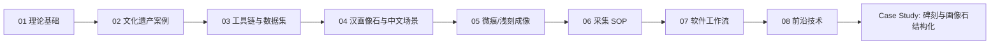

# RTI Learning

本仓库用于学习和复现实物表面精细采集相关技术，主线包括 RTI、H-RTI、photometric stereo、摄影测量、三维精细模型、数字拓片、汉画像石/碑刻图像结构化与 AI 辅助识读。

## 合并说明

2026-04-28 已将 `relics-align2` 的碑刻清晰化、重新采集、汉画像石结构化和 YOLO 学习资料合并进本仓库。

- 原 `RTI-Learning`：作为主知识库保留，包含 RTI 理论、采集 SOP、工具链、论文和硬件路线。
- 原 `relics-align2`：作为应用案例并入 [case-studies/stele-clarity-2026-04-27](case-studies/stele-clarity-2026-04-27)。
- 原始碑刻照片和算法输出图含 GPS 信息且体积较大，默认作为本地数据保留，不纳入 Git 跟踪；仓库内保留文档、来源索引、代码和复现实验说明。

## 学习路线

## 阶段文档

- [01-theory.md](01-theory.md)：RTI、PTM、HSH、RBF、光度立体、法线图、增强渲染和数据格式。
- [02-cultural-heritage-cases.md](02-cultural-heritage-cases.md)：碑刻、墓碑、陶器印章、石质浅浮雕和大型文物案例。
- [03-toolchain-and-datasets.md](03-toolchain-and-datasets.md)：RelightLab、RTIViewer、RTIBuilder、OpenLIME 和公开数据集复现。
- [04-han-stone-reliefs.md](04-han-stone-reliefs.md)：汉画像石、拓片恢复、中文石碑扫描和 2.5D 浅刻文物资料。
- [05-microtrace-reproduction.md](05-microtrace-reproduction.md)：微痕成像路线、光源矩阵、数字拓片、CHIM/IIML 和 AI 识读。
- [06-capture-sop.md](06-capture-sop.md)：面向汉画像石和碑刻的 RTI/微痕采集规范草案。
- [07-software-workflow.md](07-software-workflow.md)：后续软件系统、数据结构和处理工作流规划。
- [08-frontier-technologies.md](08-frontier-technologies.md)：现代光度立体、Neural RTI、偏振、多光谱、3D 融合和 AI 线图等前沿路线。
- [09-hardware-purchase-list.md](09-hardware-purchase-list.md)：RTI/微痕扫描硬件购买清单，按低、中、高预算规划。
- [10-iiml-knowledge-base.md](10-iiml-knowledge-base.md)：IIML、形相学、图像志标注、知识图谱和声音化实验的开发参考。
- [11-merged-project-map.md](11-merged-project-map.md)：两个项目的共同点、差异和合并后的仓库结构。
- [iiml-jsonld.schema.json](iiml-jsonld.schema.json)：IIML JSON-LD 工作草案的机器校验 schema。

## 应用案例

- [case-studies/stele-clarity-2026-04-27](case-studies/stele-clarity-2026-04-27)：碑刻照片清晰化失败复盘、重新采集路线、汉画像石结构化、YOLO 入门和样例 OpenCV 脚本。

## 资料文件夹

- [papers](papers)：公开下载的 RTI、PTM、H-RTI、光度立体、碑刻案例、汉画像石和工具指南 PDF。
- [tutorials](tutorials)：中文教程、指定阅读顺序、论文通俗解读、学习任务和阶段验收标准。
- [case-studies](case-studies)：围绕具体文物问题形成的应用案例。

## 工作原则

- 先理解公开理论，再做工具复现，最后做自己的采集和识读实验。
- 采集原始数据、处理参数、输出结果、人工判断和问题记录必须可追溯。
- AI 结果只作为候选，碑刻释读和汉画像石图像学解释需要保留人工确认、不确定性和文献依据。
- 原始图像、GPS、馆藏敏感信息和大体积输出不默认公开；需要发布时再做脱敏和压缩。
